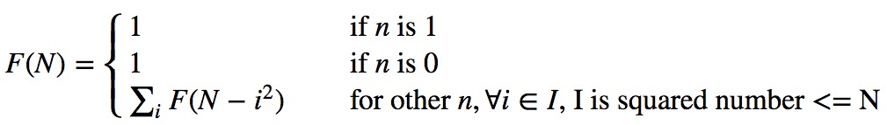

## Find solution for integer number
### Description
For each given integer number N (N>0), we can use Sum of group of "squared number" - The number could be represented by square of one integer number, to represent.  
As example: N = 9  
We can use 1 + 1 + 1 + 1 + 1 + 1 + 1 + 1 + 1 (1^2) or 9 (3^2) to stand for. However, in order to find all of group of "squared number", we need to add 2 more:  
1 +  4 + 4  
1 +  1 +  1 +  1 +  1 +  4  
So total number of group "squared number " for N = 9,  is 4.

### Solution
This problem is a kind of typical combination problem (like NP sorting). We can use recursive algorithm to solve.   

1. Math model  
Take F(N) as function, which can return total number of group "squared number " for N. then we can have math equation as follow:   

Latex expression:  
\[ F(N) =
  \begin{cases}
    1  & \quad \text{if } n \text{ is 1}\\
    1  & \quad \text{if } n \text{ is 0}\\
    \sum_{i} F(N-i^{2})       & \quad \text{for other } n,  \forall i \in I \text{, I is squared number <= N} \text{}\\
  \end{cases}
\]

Alive preview, you can attach into https://www.tuhh.de/MathJax/test/sample-dynamic-2.html.

2. Implementation  
* FindSolutionNumber - implementation in swift for just return solution number  
* FindSolution - implementation in swift, not only return solution number, but also return solution representation  
Tip:   
I, The tricky part of FindSolution func in swift, it's that I used internal recursive program structure to store prefix. in case there is one more solution, I just copy prefix once more.  
II, If you want to have a trial, you can also construct Tree<> structure in swift to copy solution, then using tree traversing algorithm to parse each solution.
